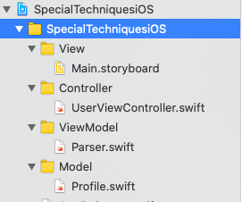
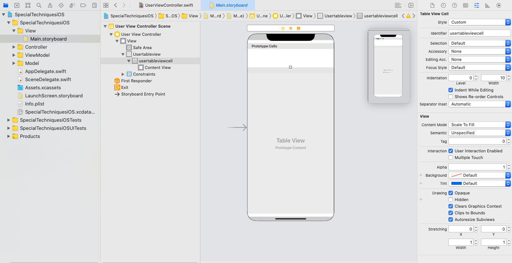

# SpecialTechniquesiOS

Basic Concepts of iOS developement included in this repo.

## master
  meged from 02mvvm
  
## 01codable
  added codable struct to the URLSession fetch data. it is very easy to handle json response
  
  Model class code - Profile.swift
  ```
import Foundation

struct WholeResponse: Codable {
    var status: Int?
    var data: [Profile]
}
struct Profile: Codable{
    var id: Int?
    var title: String?
    var description: String?
    var address: String?
    var postcode:String?
    var phoneNumber: String?
    var latitude: String?
    var longitude: String?
    var image: Images?
}

struct Images: Codable {
    var small: String?
    var medium: String?
    var large: String?
}

```
Parser.swift class

```
import Foundation

struct Parser {
    
    func parse(){
        guard let url = URL(string: "https://dl.dropboxusercontent.com/s/6nt7fkdt7ck0lue/hotels.json") else {return}
        URLSession.shared.dataTask(with: url) {
            data, response, error in
            if error != nil {
                print(error?.localizedDescription)
                return
            }
            do{
                let results = try JSONDecoder().decode(WholeResponse.self, from: data!)
                print(results)
            }catch{
                print("json decoder has error")
            }
            
        }.resume()
        
    }
```
 
## 02mvvm
  MVVM is the concept of design paten. It basically has Model, View, View Model architecture.
  Below figure shows the project structure of simple MVVM patten.
    
  Here one by one code snippet in bellow according to the MVVM.
  
  ### Model group -> Profile.swift
  The codable super class helps to json serialization from response json. It is easy way to map response.
  ```
  import Foundation

struct WholeResponse: Codable {
    var status: Int?
    var data: [Profile]
}
struct Profile: Codable{
    var id: Int?
    var title: String?
    var description: String?
    var address: String?
    var postcode:String?
    var phoneNumber: String?
    var latitude: String?
    var longitude: String?
    var image: Images?
}

struct Images: Codable {
    var small: String?
    var medium: String?
    var large: String?
}
  ```
  ### ViewModel group -> Parser.swift
  This class used to fetch data from url. it mapped withusing profile.swift class.
  ```
  import Foundation

struct Parser {
    
    func parse(comp: @escaping ([Profile])->()){
        guard let url = URL(string: "https://dl.dropboxusercontent.com/s/6nt7fkdt7ck0lue/hotels.json") else {return}
        URLSession.shared.dataTask(with: url) {
            data, response, error in
            if error != nil {
                print(error?.localizedDescription)
                return
            }
            do{
                let results = try JSONDecoder().decode(WholeResponse.self, from: data!)
//                print(results)
                comp(results.data)
            }catch{
                print("json decoder has error")
            }
            
        }.resume()
        
    }
}
  ```
  ### Controler group -> UserViewModel.swft
  Controller group is optional in MVVM model. It has two parts. table view extention and viewdidload funtion. parser used to obtain data from parser class.
  ```
  class UserViewController: UIViewController {

    @IBOutlet weak var usertableview: UITableView!
    
    var profile = [Profile]()
    let parser = Parser()
    override func viewDidLoad() {
        super.viewDidLoad()

        usertableview.delegate = self
        usertableview.dataSource = self
        parser.parse{
            data in
            self.profile = data
            
            DispatchQueue.main.async {
                self.usertableview.reloadData()
            }
        }
    }
}
  ```
  ```
  import UIKit

extension UserViewController: UITableViewDelegate, UITableViewDataSource{
    func tableView(_ tableView: UITableView, numberOfRowsInSection section: Int) -> Int {
        return profile.count
    }
    
    func tableView(_ tableView: UITableView, cellForRowAt indexPath: IndexPath) -> UITableViewCell {
        let cell = usertableview.dequeueReusableCell(withIdentifier: "usertableviewcell", for: indexPath)
        cell.textLabel?.text = profile[indexPath.row].title
        return cell
    }
    
    
}

  ```
  ### View Group -> Storyboard and other view elemant in this phase.
  


