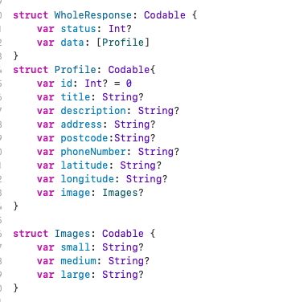
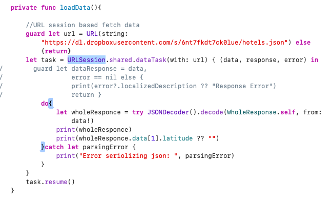
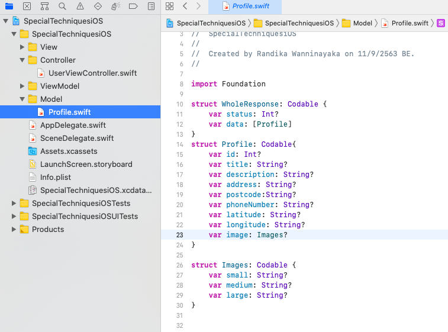
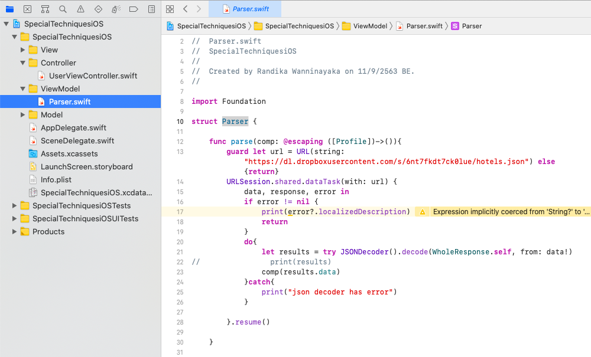
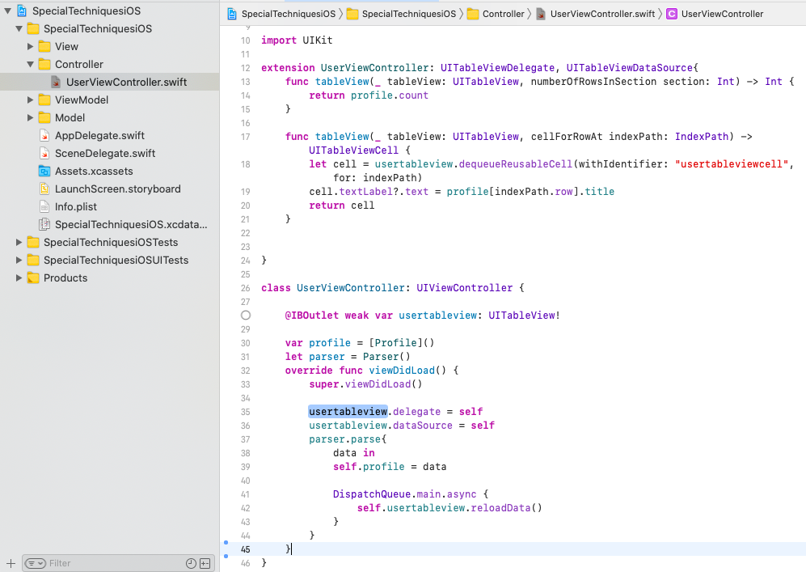

# SpecialTechniquesiOS

Basic Concepts of iOS developement included in this repo.

## master
  meged from 02mvvm
  
## 01codable
  added codable struct to the URLSession fetch data. it is very easy to handle json response
  
         
## 02mvvm
  Model, View, View Model architecture. 
    
    
  
