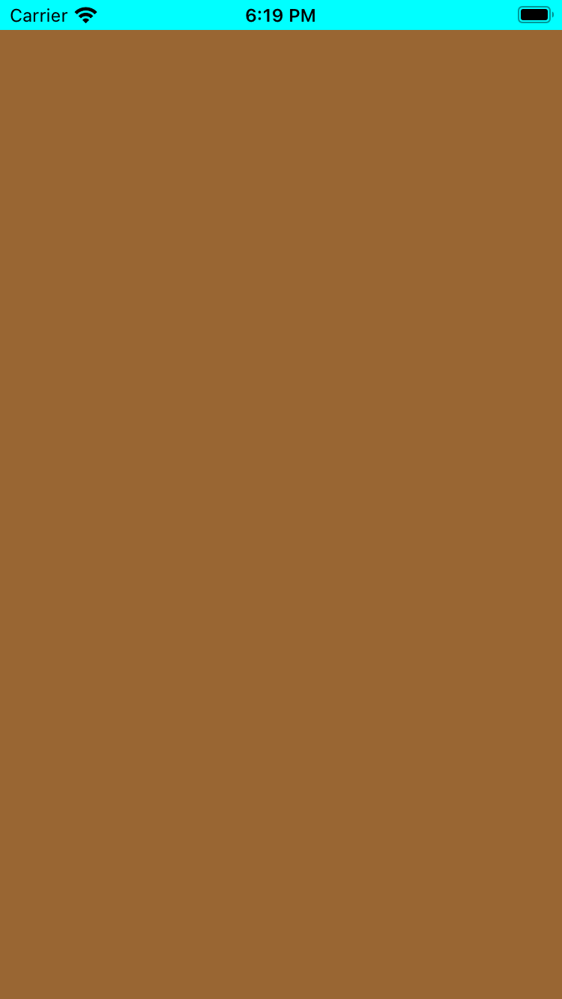
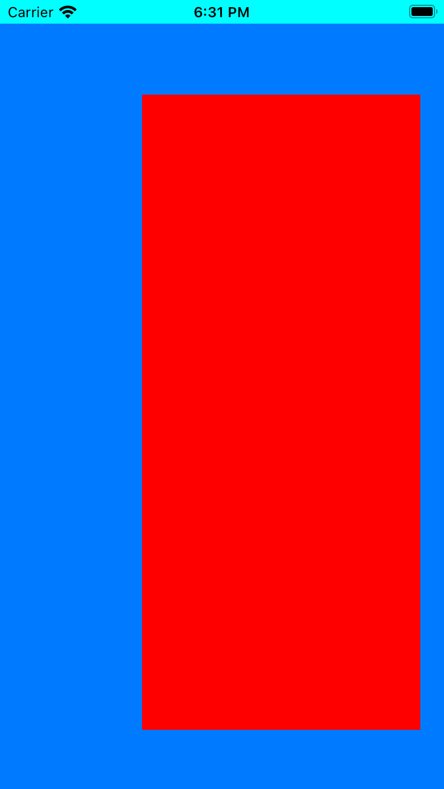
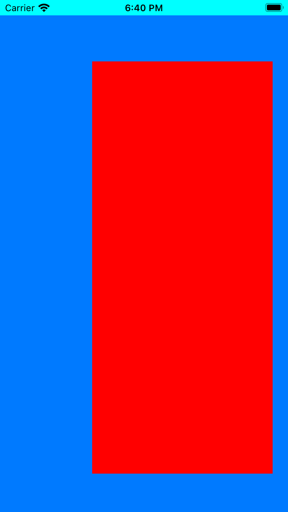
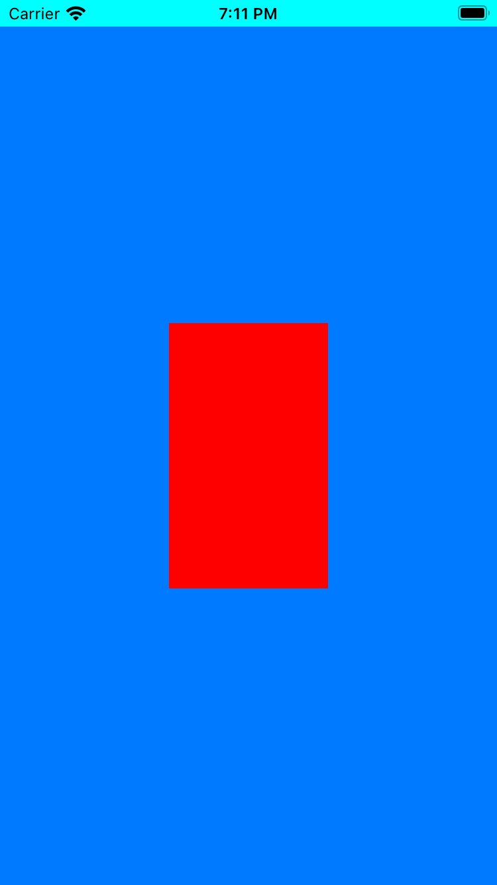

# SpecialTechniquesiOS

## 03autolayoutprogram

### Step 1: added code in SceneDelagate.swift

```
class SceneDelegate: UIResponder, UIWindowSceneDelegate {

    var window: UIWindow?


    func scene(_ scene: UIScene, willConnectTo session: UISceneSession, options connectionOptions: UIScene.ConnectionOptions) {
        // Use this method to optionally configure and attach the UIWindow `window` to the provided UIWindowScene `scene`.
        // If using a storyboard, the `window` property will automatically be initialized and attached to the scene.
        // This delegate does not imply the connecting scene or session are new (see `application:configurationForConnectingSceneSession` instead).
        
        //First step
        
        guard let windowScene = scene as? UIWindowScene else { return }
        
        window = UIWindow(frame: windowScene.coordinateSpace.bounds)
        window?.windowScene = windowScene
        window?.rootViewController = ViewController()
        window?.makeKeyAndVisible()
    }

```
### Step 2: Simple Constraint add to View
```
import UIKit

class ViewController: UIViewController {

    private let myview: UIView = {
        let myview = UIView()
        myview.translatesAutoresizingMaskIntoConstraints = false
        myview.backgroundColor = .link
        return myview
    }()
    
    override func viewDidLoad() {
        super.viewDidLoad()

        self.view.backgroundColor = .cyan
        view.addSubview(myview)
        addConstraints()
        
    }
    

    private func addConstraints(){
        var constraints = [NSLayoutConstraint]()
        
        //Add
        constraints.append(myview.leadingAnchor.constraint(equalTo: view.safeAreaLayoutGuide.leadingAnchor))
        constraints.append(myview.trailingAnchor.constraint(equalTo: view.safeAreaLayoutGuide.trailingAnchor))
        constraints.append(myview.bottomAnchor.constraint(equalTo: view.safeAreaLayoutGuide.bottomAnchor))
        constraints.append(myview.topAnchor.constraint(equalTo: view.safeAreaLayoutGuide.topAnchor))
        
        //Active
        NSLayoutConstraint.activate(constraints)
    }
}

```
#### Screenshot of screen
 

### Step 3: Add second view also with 1st view
#### 1. Create second view and add as sub view
```
    private let secondview: UIView = {
        let myview = UIView()
        myview.translatesAutoresizingMaskIntoConstraints = false
        myview.backgroundColor = .red
        return myview
    }()
    
    override func viewDidLoad() {
        super.viewDidLoad()

        self.view.backgroundColor = .cyan
        view.addSubview(myview)
        myview.addSubview(secondview)
        addConstraints()
        
    }
```
#### 2. Change constraints in add constraints
```
private func addConstraints(){
        var constraints = [NSLayoutConstraint]()
        
        //Add
        constraints.append(myview.leadingAnchor.constraint(equalTo: view.safeAreaLayoutGuide.leadingAnchor))
        constraints.append(myview.trailingAnchor.constraint(equalTo: view.safeAreaLayoutGuide.trailingAnchor))
        constraints.append(myview.bottomAnchor.constraint(equalTo: view.safeAreaLayoutGuide.bottomAnchor))
        constraints.append(myview.topAnchor.constraint(equalTo: view.safeAreaLayoutGuide.topAnchor))
        
            //Second view constraints
        constraints.append(secondview.leadingAnchor.constraint(equalTo: view.safeAreaLayoutGuide.leadingAnchor, constant: 120))
        constraints.append(secondview.trailingAnchor.constraint(equalTo: view.safeAreaLayoutGuide.trailingAnchor, constant: -20))
        constraints.append(secondview.bottomAnchor.constraint(equalTo: view.safeAreaLayoutGuide.bottomAnchor, constant: -50))
        constraints.append(secondview.topAnchor.constraint(equalTo: view.safeAreaLayoutGuide.topAnchor, constant: 60))
        
        //Active
        NSLayoutConstraint.activate(constraints)
    }
```
#### Screenshot of screen
 

### Step 4: added multipler for the width and height
```
private func addConstraints(){
        var constraints = [NSLayoutConstraint]()
        
        //Add
        constraints.append(myview.leadingAnchor.constraint(equalTo: view.safeAreaLayoutGuide.leadingAnchor))
        constraints.append(myview.trailingAnchor.constraint(equalTo: view.safeAreaLayoutGuide.trailingAnchor))
        constraints.append(myview.bottomAnchor.constraint(equalTo: view.safeAreaLayoutGuide.bottomAnchor))
        constraints.append(myview.topAnchor.constraint(equalTo: view.safeAreaLayoutGuide.topAnchor))
        
            //Second view constraints
        constraints.append(secondview.leadingAnchor.constraint(equalTo: view.safeAreaLayoutGuide.leadingAnchor, constant: 120))
//        constraints.append(secondview.trailingAnchor.constraint(equalTo: view.safeAreaLayoutGuide.trailingAnchor, constant: -20))
        constraints.append(secondview.bottomAnchor.constraint(equalTo: view.safeAreaLayoutGuide.bottomAnchor, constant: -50))
//        constraints.append(secondview.topAnchor.constraint(equalTo: view.safeAreaLayoutGuide.topAnchor, constant: 60))

            // Step 4: Must remove both constraints otherwise shows error
        constraints.append(secondview.widthAnchor.constraint(
                            equalTo: myview.widthAnchor, multiplier: 0.5))
        constraints.append(secondview.heightAnchor.constraint(
                            equalTo: myview.heightAnchor, multiplier: 0.3))
        
        //Active
        NSLayoutConstraint.activate(constraints)
    }
```
#### Screenshot of screen
 

### Step 5: added multilier and constraints
```
//        Step 5: added multilier and constraints
        constraints.append(secondview.heightAnchor.constraint(equalTo: myview.heightAnchor, multiplier: 0.3, constant: 20))
```  
### Step 6: Center constraints of width and height | fixed width and height values
```
//        Step 6: center x access and y access
        constraints.append(secondview.centerYAnchor.constraint(equalTo: myview.centerYAnchor))
        constraints.append(secondview.centerXAnchor.constraint(equalTo: myview.centerXAnchor))

//        Step 6: Width and height added
        constraints.append(secondview.widthAnchor.constraint(equalToConstant: 120))
        constraints.append(secondview.heightAnchor.constraint(equalToConstant: 200))
```
#### Screenshot of screen
 


